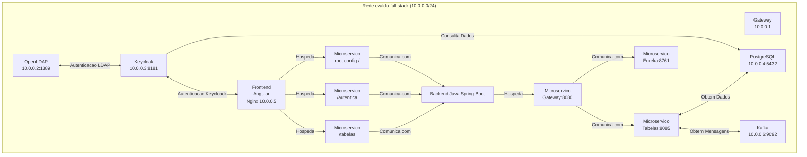

### Estou testando e preparando todos os arquivos para um ambiente full stack completo

# FullStackMicroservices
Arquitetura completa para microserviços Angular e Java Spring Boot

* **Descrição Geral:** Este projeto busca criar o ambiente completo com ldap, keycloak, microserviços angular, microserviços java spring boot, banco de dados postgresql e mensageria com kafka.
* **Pré-requisitos:** (Docker, Java, Angular, PostgreSql, Ldap, Keycloack, Kafka).
* **Instalação e Configuração:** Há um único docker-composer.yml que vai inicializar todo o ambiente.
* **Execução:** EM IMPLEMENTAÇÃO: Detalhe como iniciar cada serviço ou utilizar o docker-compose.
* **Contribuição:** Informe como outros desenvolvedores podem contribuir.
* **Licença:** Especifique a licença sob a qual o projeto é disponibilizado.

**Explicação dos componentes:**

- **OpenLDAP**: Servidor LDAP utilizado para autenticação e armazenamento de diretórios.
- **Keycloak**: Servidor de identidade e acesso que autentica usuários usando o OpenLDAP e armazena dados no PostgreSQL.
- **PostgreSQL**: Banco de dados relacional usado pelo Keycloak para persistência de dados.
- **Nginx**: Servidor web que atua como proxy reverso, direcionando tráfego para o Keycloak e possivelmente para o Kafka.
- **Kafka**: Plataforma de streaming distribuído para construção de pipelines de dados em tempo real.

**Interações entre os componentes:**

- **Nginx** encaminha solicitações HTTP na porta 80 para o **Keycloak**, que está escutando na porta 8080 internamente.
- **Keycloak** utiliza o **OpenLDAP** para autenticação de usuários via protocolo LDAP.
- **Keycloak** se conecta ao **PostgreSQL** para operações de leitura e escrita no banco de dados.
- **Nginx** pode atuar como proxy para o **Kafka**, permitindo o acesso aos serviços de streaming.

**Descrição do diagrama:**

- **Gateway (10.0.0.1)**: Todos os componentes estão conectados através deste gateway na rede `evaldo-full-stack`.
- **OpenLDAP (10.0.0.2:1389)**: Servidor LDAP acessado pelo Keycloak para autenticação.
- **Keycloak (10.0.0.3:8181)**: Servidor de autenticação que interage com o LDAP e o PostgreSQL.
- **PostgreSQL (10.0.0.4:5432)**: Banco de dados usado pelo Keycloak e pelo Backend.
- **Nginx (10.0.0.5)**: Servidor que hospeda o Frontend Angular e o Backend Spring Boot.
- **Kafka (10.0.0.6:9092)**: Plataforma de mensagens acessada pelo Backend.
- **Frontend Angular**: Aplicação cliente com microserviços `root-config`, `autentica` e `tabelas`.
- **Backend Spring Boot**: Aplicação servidor com microserviços `gateway`, `eureka` e `tabelas`.

**Interações detalhadas:**

1. **Keycloak** autentica usuários acessando o **LDAP** na porta **1389**.
2. **Keycloak** conecta-se ao **PostgreSQL** na porta **5432** para obter dados adicionais durante a autenticação.
3. O **Frontend Angular**, hospedado no **Nginx**, conecta-se ao **Keycloak** na porta **8181** para validar os dados de autenticação.
4. O **Backend Spring Boot**, também hospedado no **Nginx**, conecta-se ao **PostgreSQL** para acessar dados necessários.
5. O **Backend** conecta-se ao **Kafka** na porta **9092** para consumir a fila de mensagens.
6. Todos os componentes comunicam-se através do **Gateway** na rede `10.0.0.0/24`.

**Notas adicionais:**

- **Nginx** atua como servidor web e hospeda tanto o **Frontend** quanto o **Backend**.
- O **Frontend Angular** contém microserviços focados na interface do usuário e autenticação.
- O **Backend Spring Boot** contém microserviços para lógica de negócios e comunicação com o banco de dados e o Kafka.
- **Kafka** é utilizado para processamento assíncrono e comunicação entre serviços.

**Legenda:**

- **Setas simples** (`-->`): Indicam o fluxo de comunicação ou dependência direta.
- **Setas com rótulos** (`-->|Texto|`): Descrevem o tipo de interação ou protocolo utilizado.

Espero que este diagrama atenda às suas expectativas e represente com precisão as interações entre os seus serviços!

- Todos os serviços estão conectados à mesma rede Docker chamada `evaldo-full-stack`, com endereços IP estáticos atribuídos.
- O **Nginx** está configurado para servir conteúdo estático da pasta `./www` e utiliza a configuração `angular.conf`, o que sugere que está servindo uma aplicação Angular.
- O **Keycloak** está configurado com um mapeamento customizado através do volume `./custom-mapper`.

Espero que este diagrama ajude a visualizar a arquitetura dos seus serviços e suas interações!
